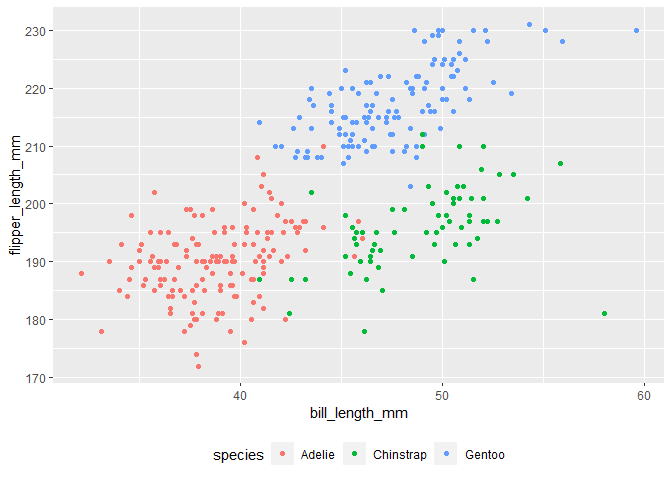

Homework 1
================
Rose Killian (rk3110)
2021-09-25

First homework for p8105!

First we load the needed libraries

``` r
library(tidyverse)
```

# Problem 1

Here’s a **code chunk** that creates a *data frame* with four different
variables:

``` r
df_1 = tibble(
  sample = rnorm(10),
  gr_than_zero = sample > 0,
  char = c("one", "two", "three", "four", "five", "six", "seven", "eight", "nine", "ten"),
  factor = factor(c("yes", "no", "maybe", "yes", "no", "maybe", "yes", "no", "maybe", "yes"))
  )
```

Next we try to take the mean of each variable:

``` r
mean(pull(df_1, sample))
```

    ## [1] -0.08959407

``` r
mean(pull(df_1, gr_than_zero))
```

    ## [1] 0.4

``` r
mean(pull(df_1, char))
```

    ## Warning in mean.default(pull(df_1, char)): argument is not numeric or logical:
    ## returning NA

    ## [1] NA

``` r
mean(pull(df_1, factor))
```

    ## Warning in mean.default(pull(df_1, factor)): argument is not numeric or logical:
    ## returning NA

    ## [1] NA

It only works for the `sample` and `gr_than_zero` variables! This is
because you can only take the mean of a numeric or logical variable.
Let’s apply the `as.numeric` function to some of our variables:

``` r
mean(as.numeric(pull(df_1, gr_than_zero)))

mean(as.numeric(pull(df_1, char)))

mean(as.numeric(pull(df_1, factor)))
```

Now we can take the mean of our factor variable in addition to our
numeric and logical variables. We still cannot take the mean of the
character variable as it cannot be converted to a numeric variable.

# Problem 2

Let’s load in our dataset:

``` r
data("penguins", package = "palmerpenguins")
```

*Still need to describe names/important variables.* The data set is 344
rows long and `r`ncol(penguins)\` columns wide. The mean flipper length
of the data set is *can’t get this to work yet come back later*

Next let’s make a plot of the data:

``` r
ggplot(penguins, aes(x = bill_length_mm, y = flipper_length_mm, color = species)) +
geom_point() +
theme(legend.position = "bottom")
```

<!-- -->
